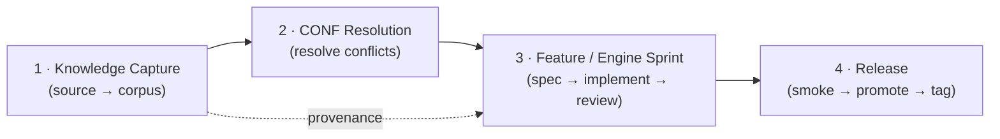
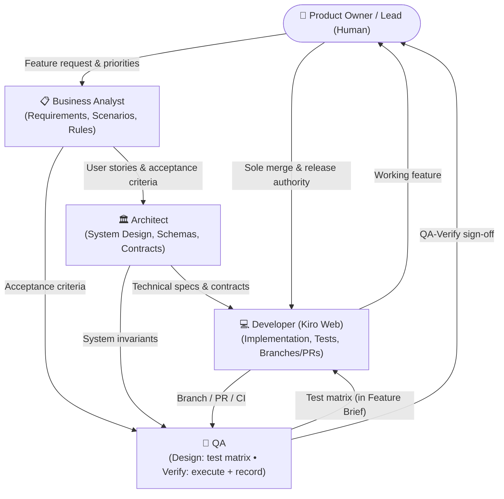
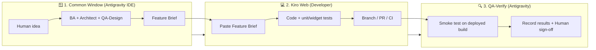
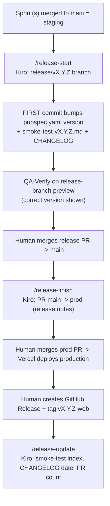
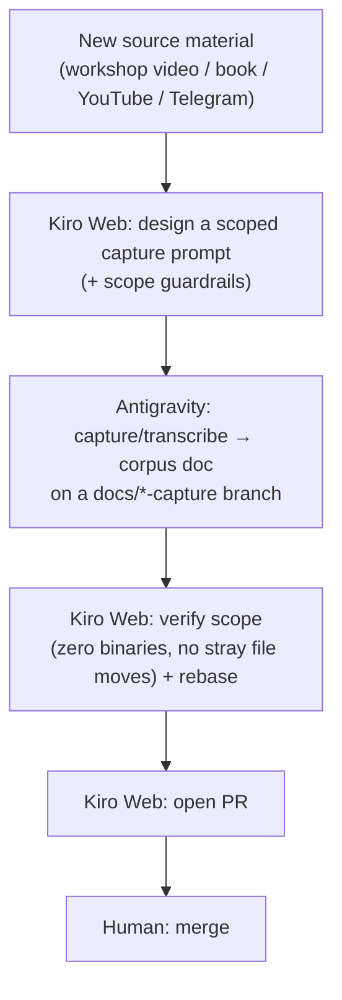
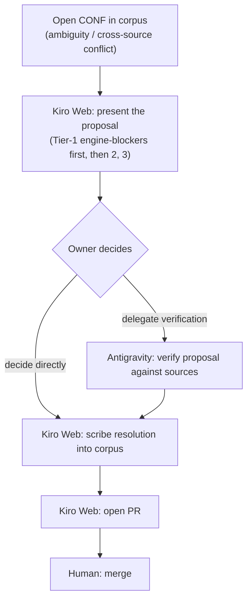
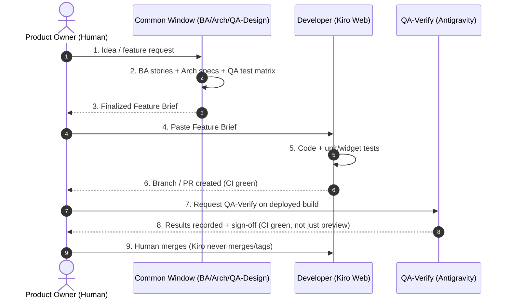

# AI Team Collaboration Framework — Saranidhi

> **Reviewed:** v1.8.0-web · **Next review:** every release (docs-audit gate) + whenever a protocol/gate/flow changes.

This document describes the multi-agent operating model used to develop the
**Saranidhi** application: how a single human lead orchestrates specialized AI
personas to take work from idea to production, and the gates that keep the
process honest.

> **Status:** Finalized model, matured through the v1.7.0 release cycle. It is
> intentionally **Saranidhi-specific**; a stack-agnostic version will be
> extracted into a reusable template (`vteial/project-blueprint`) later, once this
> process has been evaluated in real use.

---

## 0. The Four Flows (overview)

Everything this project does maps to **four repeatable end-to-end flows**. Each is
run by the Human orchestrating the same cast (Antigravity for capture/verify, Kiro
Web for planning/docs/code/PRs), and each ends at the same gate: **the Human is the
sole merge & release authority.** The detailed lifecycles for Flows 3 and 4 live in
§4 and §2.1 respectively.

| # | Flow | Trigger | Antigravity does | Kiro Web does | Human does | Artifact / record |
| :- | :--- | :--- | :--- | :--- | :--- | :--- |
| **1** | **Knowledge Capture** | New source material (workshop video, book, YouTube, Telegram notes) | Captures/transcribes source → corpus doc on a `docs/*-capture` branch, strictly scoped (no binaries, no stray file moves) | Designs the capture prompt; verifies scope; rebases; opens PR | Merges | Corpus doc (`docs/research/*-knowledge.md`) + transcripts |
| **2** | **CONF Resolution** | An open confirmation / cross-source conflict in the corpus | (optional) Delegated verification of a proposal against sources | Presents each CONF proposal (Tier-1→2→3); scribes the owner's decision into the corpus | **Adjudicates** (doctrinal authority) + merges | Resolved CONF entry in the corpus |
| **3** | **Feature / Engine Sprint** | Backlog item scheduled into a sprint | Implements the spec; runs local `analyze`+`test` green; fills impl + test summaries | Authors the spec; reviews the real diff; runs `/sprint-update` | Merges + (later) tags | Sprint **dossier** (`docs/process/sprints/sprint-N-*/`) → §4 |
| **4** | **Release** | One or more sprints on `main` ready to promote | QA-Verify smoke test on the deployed build; records results | `/release-start` → `/release-finish` → `/release-update`; drafts release notes + docs-audit | Merges release + prod PRs; **creates the tag**; ticks the docs-audit | Release **dossier** (smoke-test + release-notes + docs-audit `-vX.Y.Z.md`) → §2.1 |

> **Where the flows connect:** Flow 1 feeds Flow 2 (you can't resolve a conflict
> until the sources are captured); Flows 1+2 produce the CONF-resolved corpus that
> Flow 3 derives features from (with provenance: each feature cites the corpus
> practice + CONF it implements); Flow 3 accumulates sprints that Flow 4 ships.
> Flows **1 & 2 are doctrine-specific** to Saranidhi (a source-corpus product);
> Flows **3 & 4 are universal** to any project.



---

## 1. Team Topology & Tooling



### 1.1 Roles

| Role | Responsibilities |
| :--- | :--- |
| **Product Owner / Lead** — Human | Vision, prioritization, orchestrating prompts across windows, architectural approvals, and the **sole merge & release authority** (only the human merges PRs and creates tags). |
| **Business Analyst (BA)** | Requirements elicitation, user stories with acceptance criteria (Given-When-Then), domain business rules, personas, edge-case identification. |
| **Solution Architect** | System design, database schema, state-management architecture, service/API contracts, ADRs, non-functional requirements (security, offline-first, performance). |
| **Quality Assurance (QA)** | One role, **two phases**: **QA-Design** (authors the test matrix *before* code — happy/negative/boundary/regression — folded into the Feature Brief) and **QA-Verify** (executes tests on the deployed build, records results, logs bugs + root cause, owns the verification gate). **QA never edits source code.** |
| **Software Developer** | Feature implementation, refactoring, bug fixes, unit/widget test implementation, CI compatibility. Creates **branches and PRs but never merges to `main`/`prod` and never creates tags.** |

### 1.2 Tooling Map (how the roles are realized)

| Framework Role | Actual Tool |
| :--- | :--- |
| **Common / Strategy Window** (BA + Architect + QA-Design) | **Google Antigravity IDE**, opened in **multiple windows**, each acting as a different persona (BA / Architect / QA-Design). The multi-window approach gives the multi-persona round-table within a single tool. |
| **QA Assistant** (QA-Verify) | **Google Antigravity** — performs the real testing on deployed builds and the clerical recording (results in `docs/testing/releases/smoke-test-vX.Y.Z.md`), root-cause analysis, and bug logging. Does not edit source. |
| **Developer Agent** | **Kiro Web** (the human + Kiro) — planning, documentation, all code/PRs, and the release workflow on `vteial/saranidhi`. Also runs the **spec → coding-setup → review** handoff: Kiro Web authors the spec and reviews the PR; the Antigravity coding setup implements it and runs local tests green before the PR (see `/delegate` in `dev-workflow.md`). |

> **Local dev = pure Antigravity IDE.** Saranidhi's local development environment
> is the **Antigravity IDE on the owner's Mac** — both the persona round-table
> (Common Window) and the local coding setup live in Antigravity. (IntelliJ IDEA is
> the owner's separate *Arivagam* project, not Saranidhi.)

> **Bridge constraint:** the AI surfaces (the Antigravity Common Window, the
> Antigravity coding/QA setup, and Kiro Web) **do not share a session and cannot talk
> to each other directly.** The Human is the bridge, and the standardized
> **Feature Brief** (§5) / **sprint spec** is the message passed between the Common
> Window and the Developer Agent.

---

## 2. Practical Human Operator Playbook

The human runs the project across two main workspaces:

1. **Common / Strategy Window** — Antigravity IDE multi-window (BA, Architect, QA-Design).
2. **Developer Agent (Kiro Web)** — execution: code, docs, builds, branches/PRs, release workflow.

*(Optional: a dedicated single-role window for large, isolated deep-dives — see §3.)*



### Step-by-Step

1. **Ideate (Common Window)** — give the raw idea/bug to the team; BA, Architect, and QA-Design draft the Feature Brief.
2. **Review & approve the Feature Brief** — adjust until it matches the vision. Output: a single finalized Markdown brief.
3. **Dispatch to Kiro Web** — paste the brief; Kiro implements the code + unit tests, then pushes a branch and opens a PR.
4. **Validate** — Kiro confirms CI is green; QA-Verify smoke-tests the deployed build and records results.
5. **Merge & close** — the **Human** merges (see §2.3). Feature is closed after merge.

### 2.1 Release Lifecycle

> This is the detailed lifecycle for **Flow 4 (Release)** in the §0 map.

Beyond a single feature, releases follow a strict two-phase flow (protocol
commands live in `docs/process/dev-workflow.md`):



- **Deploy targets:** `main` → staging (saranidhi-staging.vercel.app); `prod` → production (saranidhi.vercel.app).
- **Version bump is the FIRST commit of `/release-start`** so the About card shows the correct version during staging smoke testing.
- CRITICAL gates (e.g., DB migration on fresh install *and* upgrade; core feature flows) must pass before promotion.

### 2.2 The QA Sign-off Gate — CI green, not just the preview

> **A green Vercel preview is NOT sign-off.** Before merging any release or
> promotion PR, confirm the required CI checks are green:
> - On a PR to `main`: **"Analyze, Fast Tests & Build"** (`ci.yml`) **and**
>   **"Full Test Suite + Coverage"** + **"Integration Tests (Web)"**
>   (`ci-full.yml`) — the full suite now runs on PRs into `main`, not only at
>   merge-to-main / prod promotion, so widget tests, the coverage gate, and
>   integration tests all gate pre-merge.
> - On `main → prod`: the same **"Full Test Suite + Coverage"** + **"Integration
>   Tests (Web)"** checks (heavier `ci-full.yml`).
>
> **"Integration Tests (Web)" is now a trustworthy REQUIRED gate.** Sprint 36
> (v1.6.0) removed the job's `continue-on-error` and added a bounded ChromeDriver
> readiness poll, so it no longer shows red for information — it blocks like every
> other required check. "CI green" therefore means *all **required** checks green*.
>
> *v1.5.0 proof: a literal `\n` syntax error and an 18%-vs-19% coverage shortfall
> both passed the Vercel preview but failed CI; stale integration tests only
> surfaced on the `main → prod` trigger. The preview alone would have shipped a
> broken build.*
>
> *v1.6.0 proof: `ci-full` only ran at merge-to-main, so PRs that were green on CI
> Fast (which omits widget tests + coverage) still reddened `main` after merge — a
> real About-card `RenderFlex` overflow and a real-DB widget-test crash surfaced
> only in the full suite. The fix was to run `ci-full` on PRs into `main` so the
> full gate is pre-merge, not post-merge.*

### 2.3 Merge & Tag Authority — absolute rule

> The Developer Agent (Kiro) **pushes branches, opens PRs, and validates CI, but
> NEVER merges to `main`/`prod` and NEVER creates tags.** The **Human is the sole
> merge and release authority.** This applies to every protocol
> (`/sprint-finish`, `/plan`, `/release-start`, `/release-finish`,
> `/release-update`).

### 2.4 Bug Found During QA-Verify — feedback loop

When QA-Verify finds a bug during smoke testing:

1. **Log it** in `docs/testing/releases/smoke-test-vX.Y.Z.md` — scenario, expected vs. actual, and (if known) root cause.
2. **Kiro fixes it on the same branch** (the sprint or release/PR branch) as a **new commit — never `git --amend` after a CI failure.**
3. **QA re-verifies the specific failed scenario** (targeted, not a full re-run) on the updated build.
4. Only then proceed.

*v1.5.0 proof: the `rootNavigator` nav-bar fix was applied on the release branch and re-verified via a targeted J/M scenario pass on commit `969bb4f`.*

### 2.5 Flow 1 — Knowledge Capture

The doctrine-specific flow that digitizes source material into the canonical corpus
from which the backlog is derived. This is what makes the ≥95%-fidelity goal
auditable rather than a slogan.



- **Corpus docs:** `docs/research/*-workshop-knowledge.md` (+ `docs/research/transcripts/`). Each practice is bilingual (Tamil + transliteration + English) and tagged by app-help bucket (🟢 assistable / 🟡 augmentable / 🔴 self-achieved).
- **Scope discipline (hard rule):** the capture agent stays strictly inside the knowledge doc — it must **never move, rename, or archive other files**, even if asked mid-session (a prior run wrongly archived 9 live docs; surface consequences + a separate commit instead). Prompts carry this guardrail.
- **Output feeds Flow 2:** anything ambiguous or cross-source-conflicting is logged as a **CONF** (or **CONF-PP** for Panja Pakshi) for adjudication — never silently resolved by the capture agent.

### 2.6 Flow 2 — CONF Resolution

Adjudicating the open confirmations / cross-source conflicts surfaced by Flow 1.
**The Human is the doctrinal authority; Kiro is the scribe** — the owner decides,
Kiro commits the decision via PR.



- **Authority rule:** when sources conflict, the **owner's lineage decision IS the definition of "source truth"** for the app. Kiro never adjudicates doctrine.
- **Tiering:** Tier-1 = conflicts that change the core engine (resolve before any backlog derivation); Tier-2/3 = refinements. Saranidhi resolved Sara Kalai 26/26 and Panja Pakshi 6/6 this way.
- **Downstream guarantee:** Flow 3 features must not surface an unresolved CONF as fact; each shipped rule cites the corpus practice **+ the resolved CONF** it implements (provenance/traceability discipline).

---

## 3. When to Use Dedicated vs. Common Windows

| Window | When | Advantage |
| :--- | :--- | :--- |
| **Common Window (default)** | Feature planning, multi-perspective review, triage, cross-discipline alignment. | Zero context switching; BA/Architect/QA challenge each other in real time. |
| **Dedicated BA Window** | Deep domain research, user-journey mapping, large spec/manual authoring. | Uncluttered business-modeling context. |
| **Dedicated Architect Window** | Deep refactor design, DB migration planning, complex state-machine/Riverpod work, ADRs. | Focused codebase-internals context. |
| **Dedicated QA Window** | Exhaustive test-matrix authoring, edge-case permutations. | Dedicated coverage-matrix context. |
| **Kiro Web (Developer)** | All coding, file edits, package changes, build runners, Git branches/PRs, releases. | Specialized code generation + tool execution. |

---

## 4. End-to-End Feature Lifecycle

> This is the detailed lifecycle for **Flow 3 (Feature / Engine Sprint)** in the §0
> map. The spec → coding-setup → review handoff and the per-sprint dossier are
> covered by the `/delegate` protocol in `docs/process/dev-workflow.md`.



---

## 5. Standard Handoff Template (Feature Brief)

Use this when transferring work from the Common Window to **Kiro Web**:

```markdown
# Feature: [Feature Name / ID]
**Target Release:** vX.Y.Z

## 📋 Business Context & User Stories (BA)
- **As a:** [user type]
- **I want to:** [action]
- **So that:** [benefit]

### Acceptance Criteria
- [ ] **AC-1:** Given [precondition], When [action], Then [expected outcome].
- [ ] **AC-2 (Edge Case):** Given [state], When [action], Then [error/fallback].

## 🏛️ Technical Specification (Architect)
- **Target Files / Directories:** `lib/...`, `test/...`
- **Data Models / Schema:** (note DB schema version bump + idempotent migration if any)
- **State Management / Providers:**
- **Service Interfaces / Contracts:**
- **Security / Offline Considerations:**

## 🧪 Test Matrix & Verification (QA)
### QA-Design (before code)
- **Unit tests:**
- **Widget / screen tests:**
- **Integration / flow tests:**
- **Negative / boundary scenarios:**
### QA-Verify (after build)
- **Smoke-test scenarios that gate this feature:**
- **CRITICAL gates:** (e.g., migration fresh + upgrade? core flow?)
- **Reminder:** CI green (named checks), not just the Vercel preview.
```

---

## 6. Best Practices for Human Orchestration

1. **You are the bridge.** AI personas in separate tools cannot talk directly; pass work via the standardized **Feature Brief**.
2. **Shift-left quality.** Never dispatch to Kiro Web without the **QA-Design test matrix** in the brief — it prevents shallow, untested code.
3. **Keep context clean.** Use the Common Window for alignment; let Kiro Web handle file-by-file churn.
4. **Iterative refinement.** If Kiro hits an architectural conflict, bring the error back to the Architect in the Common Window and adjust the design.
5. **Human is the sole merge & release authority.** Kiro branches/PRs and validates CI; only the human merges to `main`/`prod` and creates tags.
6. **CI green, not just the preview.** QA-Verify confirms the named required CI checks (both `ci.yml` and `ci-full.yml` run and gate on PRs into `main`) before any merge.
7. **Fix-on-same-branch loop.** A QA bug is fixed on the same PR branch as a new commit (never `--amend` after a CI failure), then the specific scenario is re-verified.
8. **Capture learnings at the moment of decision.** Record decisions, gotchas, and deferrals as durable learnings so the process compounds instead of repeating mistakes.
9. **CI Fast ≠ CI Full.** The pre-merge gate must run the same suite that runs at merge (full tests + coverage), or green PRs can still break `main`.

---

## 7. Learnings / Memory Layer

The reason this collaboration *matures* rather than repeating mistakes is a
persistent memory of decisions and lessons, kept outside of chat history.

**What to capture:**
- **Decisions & rationale** (e.g., "birth bird is permanent, derived from birth Paksha").
- **Protocol/process changes** (e.g., "version bump is the first commit of `/release-start`").
- **Gotchas & failure lessons** (e.g., "green Vercel preview ≠ green CI"; "drift `addColumn` needs an existence check").
- **Deferred items & reasons** (so they resurface in `/plan`).

**How (Saranidhi-specific mechanism):**
- **Cross-project preferences / decisions / gotchas** → **Kiro learnings** (durable, recalled every session).
- **Repository-specific conventions/rules** → `.kiro/steering/` in the repo, or the relevant `docs/` file.

**When:** at the moment a decision is confirmed or a lesson is learned — not batched later. The agent that surfaces it writes it; the Human confirms non-obvious ones.

---

## 8. Documentation Map & Freshness

This framework describes the **collaboration model**. It cross-links to — and does
**not** duplicate — the operational docs:

| Doc | Owns |
| :--- | :--- |
| `AI_COLLABORATION_FRAMEWORK.md` (this doc) | Roles, handoffs, lifecycle, gates |
| `docs/README.md` | Documentation index / map (all docs by context) |
| `docs/process/dev-workflow.md` | Protocol commands (`/plan`, `/sprint-*`, `/release-*`), branching, CI details, Lessons/Gotchas |
| `docs/process/sprint-tracker.md` | Delivered + in-progress sprints, overview table, Definition of Done |
| `docs/process/sprint-backlog.md` | Candidate/future work, epics, open decisions, ideas |
| `docs/process/sprints/sprint-N-*/` | **Flow 3** sprint dossiers (spec + implementation-summary + test-summary + README index) |
| `docs/process/templates/` | Templates for the dossier artifacts + the docs-audit gate |
| `docs/research/*-workshop-knowledge.md` | **Flow 1** corpus (practices, CONF tracker) — the doctrinal source of truth |
| `docs/testing/releases/` | **Flow 4** release dossier per version: `smoke-test-`, `release-notes-`, `docs-audit-vX.Y.Z.md` |
| `docs/testing/smoke-test-results.md` | Smoke-test results index (links every version) |
| `CHANGELOG.md` | Released version history |

> **Freshness rule:** when a protocol, gate, or **flow** changes, update
> `docs/process/dev-workflow.md` **and** this framework in the **same PR** so they
> never drift. This doc is also on the per-release **docs-audit** freshness gate
> (its `> Reviewed:` stamp is bumped when checked).
