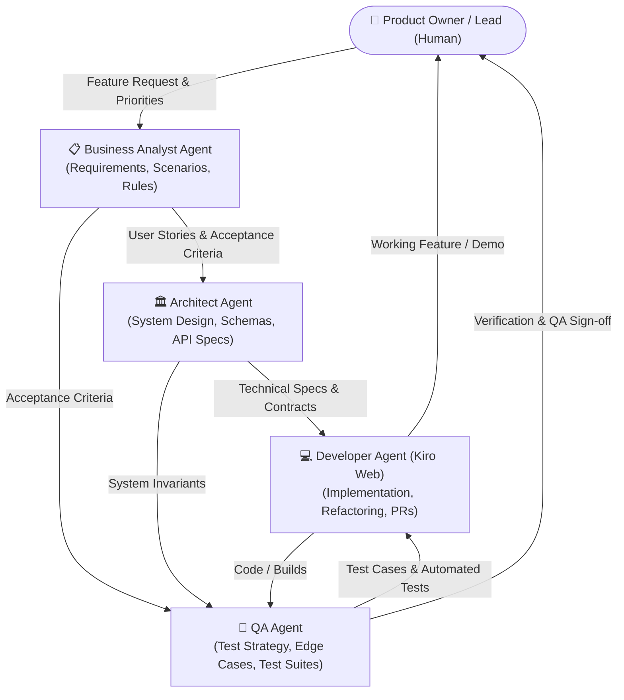
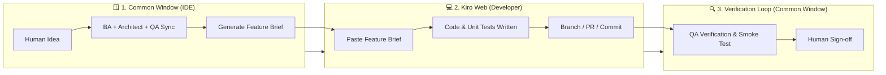
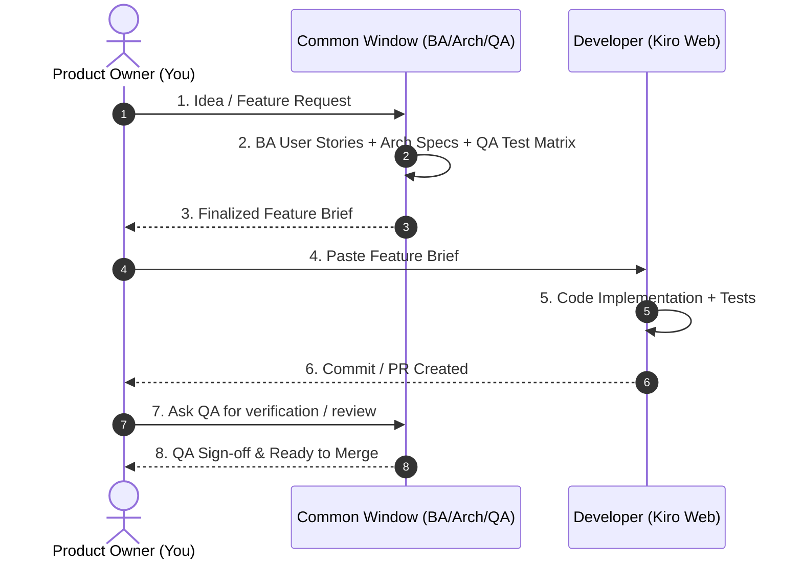

# AI Team Collaboration Framework — Saranidhi

This document outlines the multi-agent operating model and workflow for developing the **Saranidhi** application. It aligns human leadership with specialized AI personas to deliver features systematically from ideation to production.

---

## 1. Team Topology & Core Responsibilities



### Roles Breakdown

| Role | Entity | Primary Responsibilities |
| :--- | :--- | :--- |
| **Product Owner / Lead** | **Human (You)** | Vision, prioritization, orchestrating prompts across windows, final architectural approvals, and acceptance sign-off. |
| **Business Analyst (BA)** | **AI Agent** (`[BA]`) | Requirements elicitation, user story creation with Acceptance Criteria (Gherkin / Given-When-Then), domain business rules, user personas, edge-case identification. |
| **Solution Architect** | **AI Agent** (`[Architect]`) | System design, database schema, state management architecture, API/service contracts, Architecture Decision Records (ADRs), non-functional requirements (security, offline-first, performance). |
| **Quality Assurance (QA)** | **AI Agent** (`[QA]`) | Test strategy, test matrix generation (happy/negative/boundary/regression), test case definitions, automation test design (unit, widget, integration), verification against acceptance criteria. |
| **Software Developer** | **AI Agent (Kiro Web)** | Feature implementation, code refactoring, bug fixes, unit test implementation, CI/CD pipeline compatibility. |

---

## 2. Practical Human Operator Playbook (How to Manage Windows)

As the human orchestrator, you run the project across **Two Main Workspaces**:
1. **The Common / Strategy Window (This IDE Chat Session)** — Houses BA, Architect, and QA agents.
2. **The Developer Agent (Kiro Web)** — Dedicated execution environment for writing, building, and running code.
*(Optional 3rd workspace: Dedicated single-role deep-dive chat windows when tackling large, isolated problems).*



### Step-by-Step Operator Guide

#### Step 1: Ideate in the Common Window
* **Action:** Provide your raw idea, business need, or bug description in the Common Window.
* **Prompt Example:**
  > *"Team: I want to add a feature where users can export monthly expense reports to PDF and CSV. BA, Architect, QA — please review and draft the complete Feature Brief."*
* **What happens:** The BA defines requirements & edge cases, the Architect outlines schema/service contracts, and the QA drafts unit/widget test scenarios.

#### Step 2: Review and Approve the Feature Brief
* **Action:** Review the synthesized brief generated in the Common Window. Ask for adjustments if something doesn't match your vision.
* **Prompt Example:**
  > *"Architect, let's make sure CSV export works fully offline without any backend dependency."*
* **Output:** A single, finalized Markdown **Feature Brief** ready for hand-off.

#### Step 3: Dispatch to Developer (Kiro Web)
* **Action:** Copy the finalized Feature Brief block and paste it directly into Kiro Web.
* **Prompt Example in Kiro Web:**
  > *"You are the Lead Flutter Developer. Implement the following feature brief adhering strictly to the architecture contracts and satisfying all acceptance criteria and test cases. Generate all necessary code and test files.*
  > 
  > *[PASTE FEATURE BRIEF HERE]"*

#### Step 4: Validate Code & Quality Assurance
* **Option A (If Kiro Web runs tests):** Review Kiro's test execution summary and commit diff.
* **Option B (If reviewing in Common Window):** Come back to the Common Window and ask QA to review:
  > *"@QA: Review the implementation of `lib/features/export/...` and `test/features/export/...`. Did Kiro meet all acceptance criteria and edge cases?"*

#### Step 5: Merge and Close
* **Action:** Run smoke tests, review git status/PR, and sign off on the feature.

---

## 3. When to Use Dedicated vs. Common Windows

| Window Type | When to Use | Advantages |
| :--- | :--- | :--- |
| **Common Window (Recommended Default)** | Feature planning, multi-perspective reviews, triage, and cross-discipline alignment. | Zero context switching; BA, Architect, and QA challenge each other's assumptions in real time. |
| **Dedicated BA Window** | Complex domain research, extensive user journey mapping, writing large user manuals or spec sheets. | Deep, uncluttered context for business modeling. |
| **Dedicated Architect Window** | Deep refactoring design, database migration planning, complex Riverpod/state-machine architecture, ADR drafting. | Focused context on codebase internals and patterns. |
| **Dedicated QA Window** | Exhaustive test suite authoring, edge-case permutations, integration test script generation. | Dedicated context for test coverage matrices. |
| **Kiro Web (Developer)** | All coding, file edits, package additions, running build runners, and Git commits. | Dedicated agent specialized in code generation and tool execution. |

---

## 4. End-to-End Feature Lifecycle



---

## 5. Standard Handoff Template (Feature Brief)

Use this format when transferring work from the Common Window to **Kiro Web**:

```markdown
# Feature: [Feature Name / ID]

## 📋 Business Context & User Stories (BA)
- **As a:** [user type]
- **I want to:** [action]
- **So that:** [benefit]

### Acceptance Criteria
- [ ] **AC-1:** Given [precondition], When [action], Then [expected outcome].
- [ ] **AC-2 (Edge Case):** Given [state], When [action], Then [error/fallback].

## 🏛️ Technical Specification (Architect)
- **Target Files / Directories:** `lib/...`, `test/...`
- **Data Models / Schema:**
- **State Management / Providers:**
- **Service Interfaces / Contracts:**
- **Security / Offline Considerations:**

## 🧪 Test Matrix & Verification (QA)
- **Unit Tests Required:**
- **Widget / Screen Tests:**
- **Integration / Flow Tests:**
- **Negative / Boundary Scenarios to Assert:**
```

---

## 6. Best Practices for Human Orchestration

1. **You Are the Bridge:** AI agents in separate tools (IDE vs. Kiro Web) cannot talk to each other directly. You act as the bridge using the standardized **Feature Brief**.
2. **Shift-Left Quality:** Never send a task to Kiro Web without the **QA Test Matrix** included. This prevents Kiro from writing untested or shallow code.
3. **Keep Context Clean:** Use the Common Window for high-level alignment; let Kiro Web handle the file-by-file code churn.
4. **Iterative Refinement:** If Kiro gets stuck or hits an architectural conflict, bring the error message back to the Common Window:
   > *"@Architect: Kiro encountered this type error / dependency conflict during implementation: [paste error]. How should we adjust the design?"*
