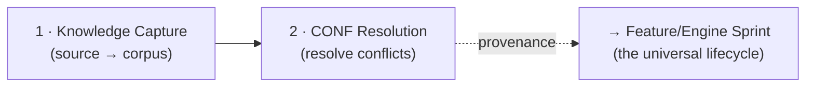
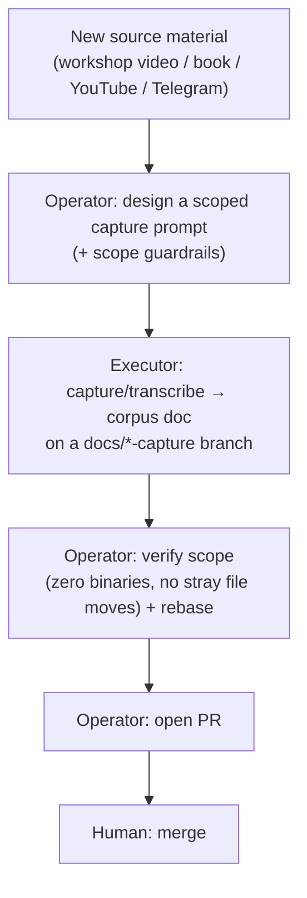
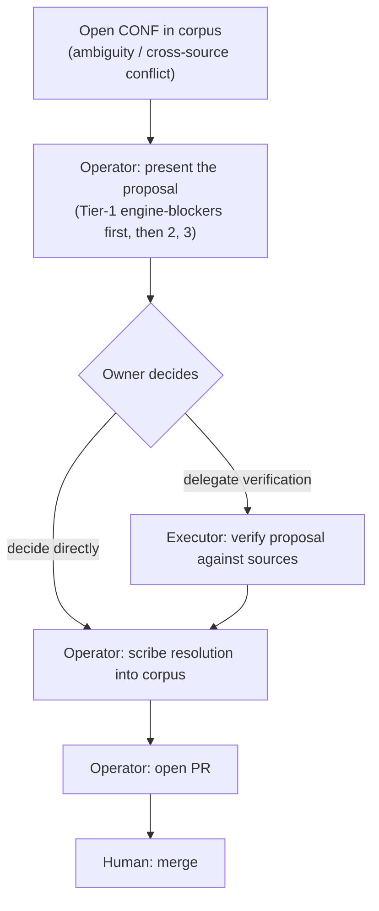

<!--
  Canonical path: ~/dev-home/personal/saranidhi/docs/process/doctrine-flows.md
  Saranidhi-specific doctrine flows (Knowledge Capture + CONF Resolution).
  Extracted from the retired AI_COLLABORATION_FRAMEWORK.md on 2026-10-03 — saranidhi owns this copy.
  Last verified: 2026-10-03 (v1.13.0-web).

  > **Reviewed:** v1.13.0-web
-->
# Saranidhi — Doctrine Flows (Knowledge Capture + CONF Resolution)

These two flows are **specific to Saranidhi** as a source-corpus product — they have no
equivalent in the universal cetana-labs family lifecycle (which covers only the
Feature/Engine sprint and Release flows, now in
[`dev-workflow.md`](dev-workflow.md) + [`collaboration-guardrails.md`](../../.kiro/steering/collaboration-guardrails.md)).
They feed that lifecycle: the CONF-resolved corpus is what sprints derive features from, with
provenance (each shipped rule cites the corpus practice **+ the resolved CONF** it implements —
the standing **RC** criterion in every Kiro Spec).

Roles below are the generic **Operator / Executor / Human** roles; which tool plays each is in
the [tool→role mapping](../../.kiro/steering/collaboration-guardrails.md) (§2).

---

## Flow 1 — Knowledge Capture

Digitizes source material into the canonical corpus from which the backlog is derived. This is
what makes the ≥95%-fidelity goal auditable rather than a slogan.

- **Corpus docs:** `docs/research/*-workshop-knowledge.md` (+ `docs/research/transcripts/`). Each practice is bilingual (Tamil + transliteration + English) and tagged by app-help bucket (🟢 assistable / 🟡 augmentable / 🔴 self-achieved).
- **Scope discipline (hard rule):** the capture agent stays strictly inside the knowledge doc — it must **never move, rename, or archive other files**, even if asked mid-session (a prior run wrongly archived 9 live docs; surface consequences + a separate commit instead). Prompts carry this guardrail.
- **Output feeds Flow 2:** anything ambiguous or cross-source-conflicting is logged as a **CONF** (Sara Kalai) or **CONF-PP** (Panja Pakshi) for adjudication — never silently resolved by the capture agent.

---

## Flow 2 — CONF Resolution

Adjudicating the open confirmations / cross-source conflicts surfaced by Flow 1.
**The Human is the doctrinal authority; the Operator is the scribe** — the owner decides,
the Operator commits the decision via PR.

- **Authority rule:** when sources conflict, the **owner's lineage decision IS the definition of "source truth"** for the app. The Operator never adjudicates doctrine.
- **Tiering:** Tier-1 = conflicts that change the core engine (resolve before any backlog derivation); Tier-2/3 = refinements. Saranidhi resolved Sara Kalai 26/26 and Panja Pakshi 6/6 this way.
- **Downstream guarantee:** sprint features must not surface an unresolved CONF as fact; each shipped rule cites the corpus practice **+ the resolved CONF** it implements (the standing **RC** EARS criterion — provenance/traceability discipline).

---

[← Back to dev-workflow](dev-workflow.md)
