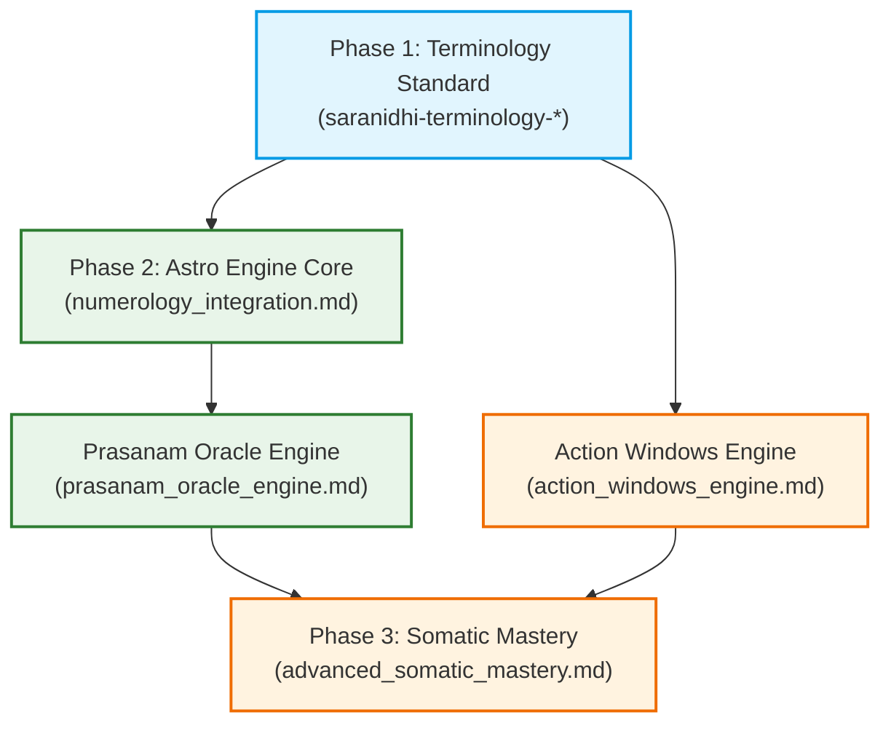

# Saranidhi Implementation Roadmap: Chronobiology & Somatic Integration

This document outlines the recommended implementation order and dependency sequence for incorporating **Terminology Standard**, **Numerology/Sankhya Sastra**, **Action Windows**, **Prasanam Oracle**, and **Advanced Somatic Mastery** (realignment and analytics) into the Saranidhi app.

Additionally, it weaves in low-overhead **Holistic Living & Somatic Integrations** (Grounding, Dietary Chronobiology, Energy Budgeting, and Element Balancing) to provide immediate practical value to the end user.

---

## Technical Dependency Flow

---

## Phase 1: Terminology Ingestion & Localization

### 1. Focus Artifacts
* `docs/research/saranidhi-terminology-en.md`
* `docs/research/saranidhi-terminology-ta.md`
* `docs/research/holistic_living_proposals.md` (Grounding & Awakening guide sections)

### 2. Implementation Scope
Establish the shared domain vocabulary in both languages across the codebase and expand static user documentation.

### 3. Kiro Web Action Items
1. **Localization Bundles:** Map the English and Tamil terms (e.g., *Ida/Idakalai*, *Pingala/Pingalai*, *Sushumna/Suzhumunai*, and the 5 Pakshi states) to the app's `arb` localization files or string providers.
2. **UI Copy Standardization:** Audit the user guides, tooltips, and dashboard headers to ensure terms match the Siddha/Swarodaya standards.
3. **Somatic Awakening Guide:** Append the **Swara Pada Gamana** (Grounding foot step rule) and **Swara-Ahara** (Dietary rules) to the in-app User Guide to introduce these somatic habits early to the user.

---

## Phase 2: Astro Engine Core & Prasanam Oracle

### 1. Focus Artifacts
* `docs/research/numerology_integration.md`
* `docs/research/prasanam_oracle_engine.md`
* `docs/research/holistic_living_proposals.md` (Energy budgeting guidelines)

### 2. Implementation Scope
Resolve profile onboarding fallbacks and build the complete multi-factor query assessment logic (Prasanam) incorporating element, time, and breath factors.

### 3. Dependency Prerequisites
* Phase 1 terminology names mapped to code enums.

### 4. Kiro Web Action Items
1. **Phonetic Onboarding:** Implement `NameBirdParser` to resolve starting vowels to a birth bird. Integrate this into the profile setup view as a fallback when the user doesn't know their birth star.
2. **Navatara Weights:** Implement the `TaraCategory` enum with the modulo-9 formula `(TransitIndex - BirthIndex + 27) % 9 + 1` and corresponding multiplier weights.
3. **Hora-Swara Resonance:** Implement `PlanetaryHora` classifications (Solar, Lunar, Neutral) and the `HoraSwaraAffinity` multiplier matrix.
4. **Oracle Composite Score:** Update `OracleCalculator` to compute basic composite scores.
5. **Prasanam Oracle Engine:** Build the query parser (`PrasanamQuery`), the response band evaluator (`PrasanamResult` / `OracleBand`), and implement the multi-factor scoring matrix containing the Category Harmony coefficients and the Swara-Query alignment rules.
6. **Task-Energy Alignment Advice:** Weave cognitive energy recommendations into the Prasanam results. If a user asks an Artha query during a conflicting window, append guidance suggesting they defer analytical tasks.

---

## Phase 3: Action Windows & Somatic Realignment (Somatic Mastery)

### 1. Focus Artifacts
* `docs/research/action_windows_engine.md`
* `docs/research/advanced_somatic_mastery.md`
* `docs/research/holistic_living_proposals.md` (Thermal regulation & dietary fire hacks)

### 2. Implementation Scope
Build the consolidated notification triggers, guided physical realignment interfaces, and the historical stagnancy alarm engine.

### 3. Dependency Prerequisites
* Phase 2 composite score logic (to check when the Oracle status is `blocked`).
* Access to `SaraKalaiJournal` database tables for query analytics.

### 4. Kiro Web Action Items
1. **Database Schema Update:** Add the `SomaticInterventionLogs` table via a Drift database migration.
2. **Action Windows Engine:** Implement the yama-to-window consolidation algorithm in `ActionWindowsEngine` to merge consecutive matching windows. Set up the local notification scheduler using a Riverpod provider to schedule a consolidated 48-hour rolling queue.
3. **Intervention Timer Rooms:** Implement the full-screen Material 3 countdown rooms with the pacer animation (Sama Vritti 4:4:4:4) and the contralateral body positions (e.g., right side posture or right armpit pressure to open the left nostril).
4. **Validation Flow:** Implement the `GuidedNostrilTest` prompt that automatically triggers on timer completion to log outcomes.
5. **Analytics Parser:** Code the `ChronobiologyAnalytics` algorithm using the chronological sliding window logic to evaluate locked nostril durations ($\ge 6$ hours for mild, $\ge 8$ hours for chronic) and serve specific heating/cooling lifestyle cards on the dashboard.
6. **Dynamic Somatic Realignment Cards:** 
   - Integrate **Swara-Ahara (Dietary fire)** prompts on the Kriya Focus Card, prompting the user to ensure Surya flow is active before eating.
   - Integrate **Tattva-Somatic Temperature Regulation** tips (e.g., *Sheetali* cooling breath for excess fire elements) on the dashboard when stagnancy is detected.
   - Send the **Swara Pada Gamana** waking advice in the daily morning summary notification.
