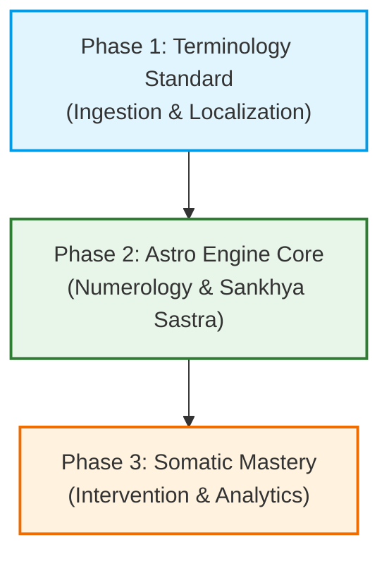

# Saranidhi Implementation Roadmap: Chronobiology & Somatic Integration

This document outlines the recommended implementation order and dependency sequence for incorporating **Terminology Standard**, **Numerology/Sankhya Sastra**, and **Advanced Somatic Mastery** into the Saranidhi app.

This roadmap serves as the structural guide for **Kiro Web** during sprint planning, database migrations, and component development.

---

## Technical Dependency Flow

---

## Phase 1: Terminology Ingestion & Localization

### 1. Focus Artifacts
* `docs/research/saranidhi-terminology-en.md`
* `docs/research/saranidhi-terminology-ta.md`

### 2. Implementation Scope
Establish the shared domain vocabulary in both languages across the codebase.

### 3. Kiro Web Action Items
1. **Localization Bundles:** Map the English and Tamil terms (e.g., *Ida/Idakalai*, *Pingala/Pingalai*, *Sushumna/Suzhumunai*, and the 5 Pakshi states) to the app's `arb` localization files or string providers.
2. **UI Copy Standardization:** Audit the user guides, tooltips, and dashboard headers to ensure terms match the Siddha/Swarodaya standards defined in the terminology sheets.

---

## Phase 2: Astro Engine Core (Numerology & Sankhya Sastra)

### 1. Focus Artifacts
* `docs/research/numerology_integration.md`

### 2. Implementation Scope
Resolve profile onboarding fallbacks and enhance the daily auspiciousness calculation layer with numerical and astronomical weighting factors.

### 3. Dependency Prerequisites
* Phase 1 terminology names mapped to code enums.

### 4. Kiro Web Action Items
1. **Phonetic Onboarding:** Implement `NameBirdParser` to resolve starting vowels to a birth bird. Integrate this into the profile setup view as a fallback when the user doesn't know their birth star.
2. **Navatara Weights:** Implement the `TaraCategory` enum with the modulo-9 formula `(TransitIndex - BirthIndex + 27) % 9 + 1` and corresponding multiplier weights.
3. **Hora-Swara Resonance:** Implement `PlanetaryHora` classifications (Solar, Lunar, Neutral) and the `HoraSwaraAffinity` multiplier matrix.
4. **Oracle Composite Score:** Update `OracleCalculator` to compute:
   $$\text{Auspiciousness} = \text{BaseScore} \times \text{TarabalaMultiplier} \times \text{HoraSwaraMultiplier}$$

---

## Phase 3: Somatic Realignment & Analytics (Advanced Somatic Mastery)

### 1. Focus Artifacts
* `docs/research/advanced_somatic_mastery.md`

### 2. Implementation Scope
Build the guided physical realignment interfaces and compile the time-weighted sliding window to alert users of continuous nose flow stagnancy.

### 3. Dependency Prerequisites
* Phase 2 composite score logic (to check when the Oracle status is `blocked`).
* Access to `SaraKalaiJournal` database tables for query analytics.

### 4. Kiro Web Action Items
1. **Database Schema Update:** Add the `SomaticInterventionLogs` table via a Drift database migration.
2. **Intervention Timer Rooms:** Implement the full-screen Material 3 countdown rooms with the pacer animation (Sama Vritti 4:4:4:4) and the contralateral body positions (e.g., right side posture or right armpit pressure to open the left nostril).
3. **Validation Flow:** Implement the `GuidedNostrilTest` prompt that automatically triggers on timer completion to log outcomes.
4. **Analytics Parser:** Code the `ChronobiologyAnalytics` algorithm using the chronological sliding window logic to evaluate locked nostril durations ($\ge 6$ hours for mild, $\ge 8$ hours for chronic) and serve specific heating/cooling lifestyle cards on the dashboard.
